# Task 1: Create Files

1.Create empty file devops.txt using touch

2.Create notes.txt with some content

3.Create script.sh using vim with content

# Task 2: Read Files
1. Read Devops.sh using cat

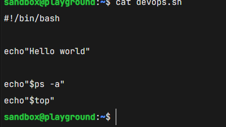

2. Display first 5 lines of /etc/passwd

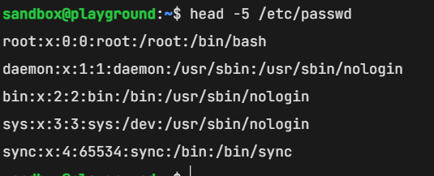

3. Display last 5 lines of /etc/passwd using tail

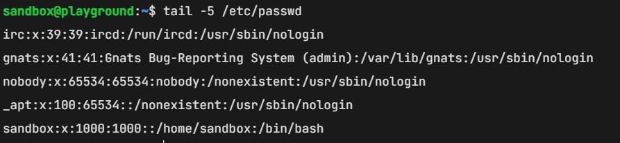

# TASK 3: Understand Permissions

1. Understand Permissions  r read=4 w write=2  e execute=1

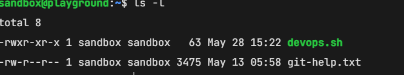

# Task 4: Modify Permissions
1. Make script.sh executable

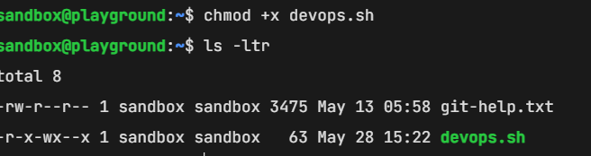

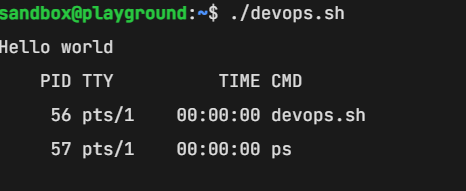

2. Set devops.txt to read-only

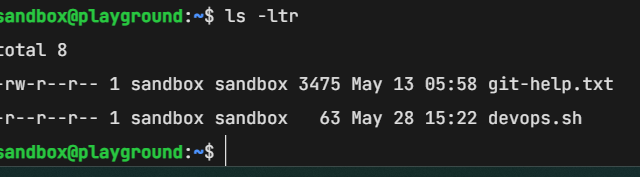

3. Set notes.txt to 640 (owner: rw, group: r, others: none)

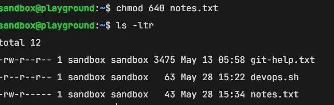

4. Create directory project/ with permissions 755

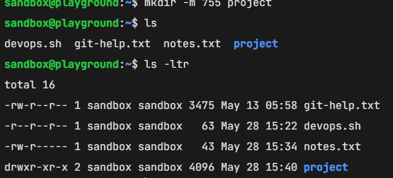

# Task 5: Test Permissions

1. Try writing to a read-only file - what happens?

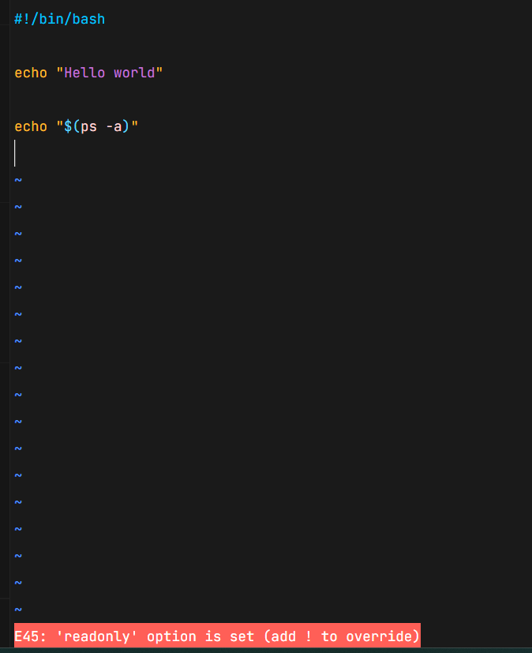

2. Try executing a file without execute permission

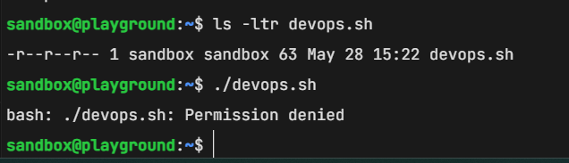
